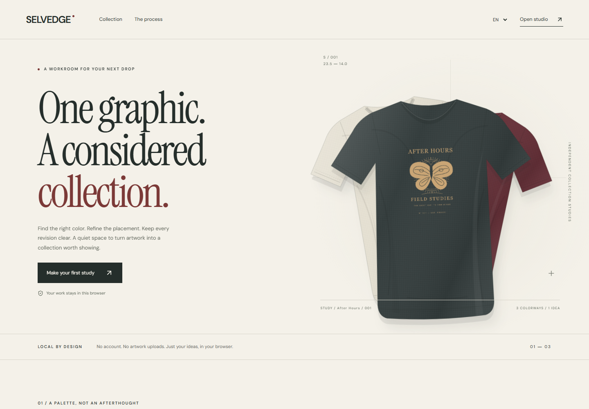
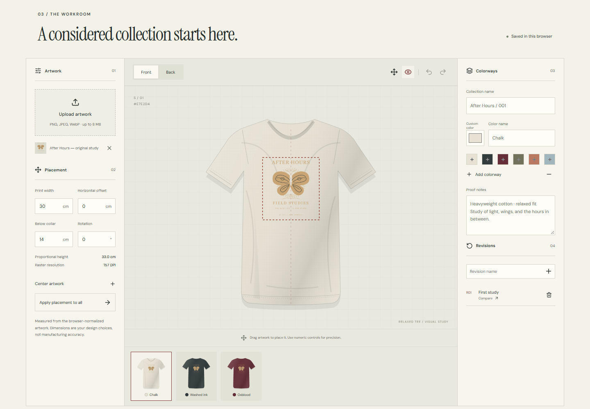
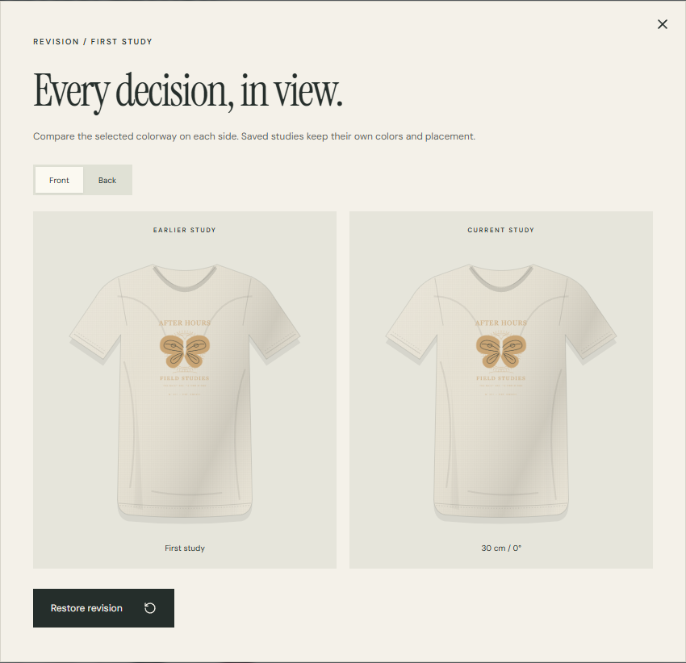
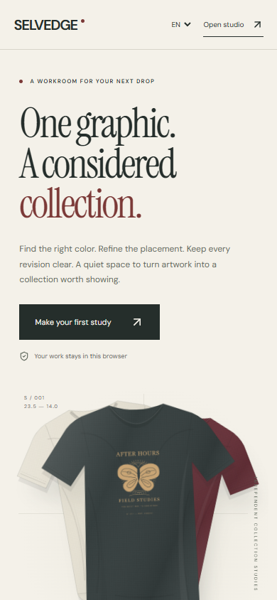

# SELVEDGE

**One graphic. A considered collection. Every revision clear.**

[](https://github.com/seoshiro/selvedge-studio/actions/workflows/publish.yml)

[Open the live studio](https://seoshiro.github.io/selvedge-studio/) · [How it works](docs/ARCHITECTURE.md) · [Verification](docs/VERIFICATION.md) · [Sources](docs/PROVENANCE.md)

A browser-local workroom for small apparel brands and merch designers. Bring one graphic into a coordinated tee collection, keep a record of the decisions, and export something clear for the next conversation with your printer.



## The workroom

- Upload PNG, JPEG, or WebP artwork. Nothing is sent to an image service.
- Edit front and back placement with drag and numeric controls. On touch screens, enable the move tool to drag; leave it off to scroll.
- Set print width in centimeters, proportional height, horizontal offset, distance below the collar, and rotation.
- Build up to six colorways with six curated colors or your own palette. Apply placement across the collection or edit one variant.
- Undo and redo up to 50 edits. Save eight named revisions, compare either side, and restore a direction.
- Download a real collection PNG, a PDF proof, and a portable JSON project containing artwork, placements, notes, and revisions.
- Reload or import a project to continue. Transactional local saves protect against another tab overwriting your work.
- Use the full interface in English, Russian, or Kazakh. Reduced motion and numeric alternatives are built in.



<table><tr><td width="68%"></td><td width="32%"></td></tr></table>

## Run locally

Node 24 is used in CI (Node 22.12+ is supported by the build tool).

```sh
npm ci --ignore-scripts
npm run dev
```

The development server uses port **5279**. For the same static artifact checked by browser tests:

```sh
npm run build
node scripts/serve.mjs
```

```sh
npm run lint
npm run typecheck
npm test
npx playwright install chromium
npm run test:e2e
```

On Windows, browser tests use installed Google Chrome. CI uses Playwright Chromium. Each test starts an isolated browser context with synthetic artwork. The public workflow checks the source and browser flows before deploying the exact commit to GitHub Pages.

## Practical limits

This is a **visual proof**, not a 3D renderer, a manufacturing specification, or certified print-ready output. The SVG garment is an original illustration. Centimeter values are the author's chosen dimensions against a nominal template; confirm physical dimensions, print method, garment size, and color with your printer. Artwork outside the garment silhouette is visually clipped. Hex colors are screen colors, not Pantone references.

Images: up to 8,000,000 source bytes (8 MB), 16 megapixels, and 8192 pixels per source edge. A source file's compressed size differs from its stored PNG size. Artwork is normalized to at most 2048 pixels per edge, preserving alpha and proportions. Complex artwork is adaptively resized to fit 3,000,000 encoded characters (about 2.25 MB binary, including encoding overhead). Extra resizing opens a preview with exact dimensions and DPI; accept it or keep your current artwork. Resolution warnings and exports use the final stored dimensions. The original file is unchanged; use it for production with your printer. The project supports 16 artwork records, 20 million encoded artwork characters, six colorways, eight revisions, and a 24 MB import file. Delete revisions or export and start fresh when a limit is reached.

PDF pages are rasterized visual proofs, preserving Unicode through browser text rendering; they do not contain editable vector print artwork or searchable proof text. Long notes receive additional pages. PNG height expands to fit notes. Empty runs of blank lines are visually compacted in proofs; portable projects retain the exact notes.

IndexedDB persists the current project in this browser. Browser clearing, private browsing, device changes, or storage pressure can remove it. Keep portable project backups. GitHub Pages projects under `seoshiro.github.io` share an origin; this app namespaces its storage and does not clear neighboring data, but origin separation is not a security guarantee. The privacy dialog explains this boundary.

## Hosting and cost

This is a free, open-source portfolio demo on GitHub Pages. No account, backend, analytics, API key, paid asset, domain purchase, payment flow, or billing change is required. A commercial operator should choose hosting suitable for its intended use and the provider's terms rather than treating this demo as an operating SaaS business.

Original code, garment illustration, and sample graphic: MIT. Bundled fonts: SIL OFL 1.1. Lucide icons: ISC. See [source provenance](docs/PROVENANCE.md).
